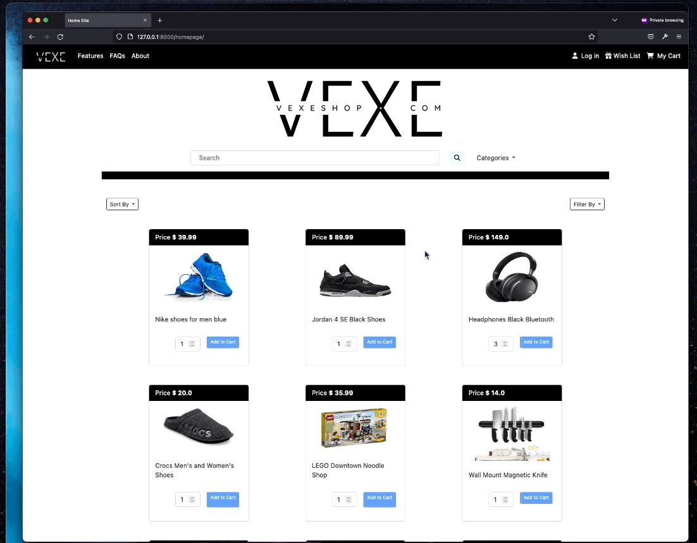
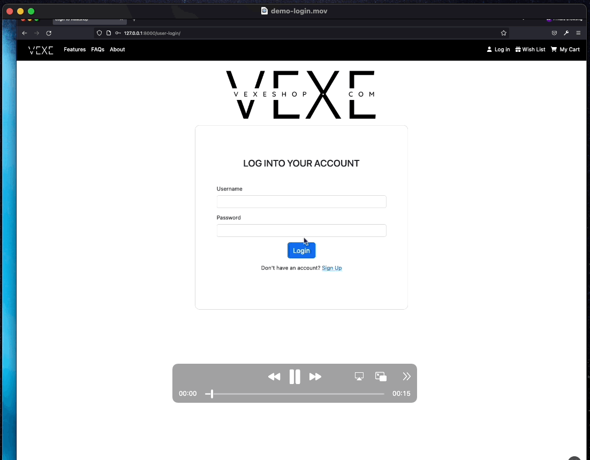

# ECommerce Website Using Django

## Table of contents:
- [Introduction](#what-is-this-about-introduction)
- [Source of Inspiration](#source-of-inspiration)
- [Screen captures](#screen-captures)
- [Issues/Contribution](#issuescontribution)

### What is this about? (Introduction)

An sophisticated website project for an ecommerce platform. This website was developed using Python, and some of its popular libraries 
including the Django Framework. Other front-end technologies were also used to achieve the sleek styling and designs of the main sites,
 some include: HTML, CSS, Bootstrap and JQuery.

### Source of Inspiration

After delving deeply into the Django Framework and gaining a broader understanding of its inner workings, I became especially captivated by its simplicity and coordination
 with third party packages. I decided to integrate some of these and test out some of its highly robust features. I.e -> User authentication system, Django's built-in
 template language, notebook compatibility, security features, etc. 

Though I do not have a solid foundation on UX design and styling, as my main focus resides in the backend technologies, I strived to make this project elegant and appealing to the eye. I am quite delighted with the outcome, and much of this was accomplished thanks to the use of Bootstrap, their framework provides you with a variety of stylized components ready for integration with only a few lines of code which connects to their presets through their CDN. They also have great documentation, it was great help, as it drastically sped up the development time and was also useful fixing bugs along the way.

### Screen captures:
(These might take a few seconds to load)
- Homepage overview, testing responsiveness.

- User Registration with functional form validation, creating customer user account.

- Existent User Login.

- Homepage functional components.

- Adding selected items to cart; adjusting quantity, deleting items and description overview of product.

- Cart Checkout; Button animation and modal drop for checkout credit card payment. Non-functional, display only.

- Adding new product to store and validating data upload.

### Issues/Contribution

The dependencies and requirements of this project can be found in requirements.txt, if you forked this repo and spot an issue please reach out to me I'll be happy to help. Same goes for all contributions, if you have something to add, features, suggestions, or both, open a merge request and I'll check it out.
